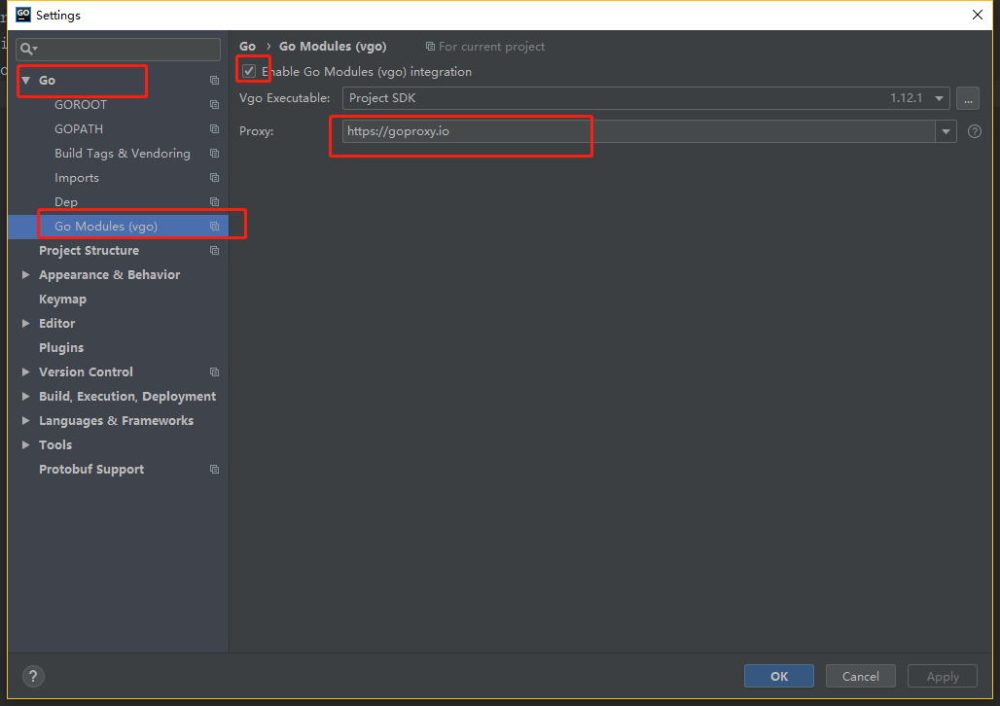

# Base64captcha supports digits, numbers, alphabet, arithmetic, audio and digit-alphabet captcha.
[](https://goreportcard.com/report/github.com/mojocn/base64Captcha)
[](https://godoc.org/github.com/mojocn/base64Captcha)
[](https://travis-ci.org/mojocn/base64Captcha)
[](https://codecov.io/gh/mojocn/base64Captcha)

[](https://codebeat.co/projects/github-com-mojocn-base64captcha-master)
[](http://golangfoundation.org)

Base64captcha supports digit, number, alphabet, arithmetic, audio and digit-alphabet captcha.
Base64Captcha is used for fast development of RESTful APIs, web apps and backend services in Go.
give a string identifier to the package and it returns with a base64-encoding-png-string
#### Why Base64 for RESTful Application
      Data URIs are now supported by all major browsers. IE supports embedding images since version 8 as well.
      RESTful Application returns small base64 image is more convenient.

#### Documentation

* [English](https://godoc.org/github.com/mojocn/base64Captcha)
* [中文文档](https://github.com/mojocn/base64Captcha/blob/master/README_zh.md)

#### [Playground Powered by Vuejs+elementUI+Axios](http://captcha.mojotv.cn)

[](https://www.youtube.com/watch?v=Yf0xDn2Q1Ek)

## Quick Start

### Download and Install

    go get -u github.com/mojocn/base64Captcha
For Gopher from mainland China without VPN `go get golang.org/x/image` failure solution:
- go version > 1.11
- set env `GOPROXY=https://goproxy.io`
- 

### Create Captcha Code
```
import "github.com/mojocn/base64Captcha"
func demoCodeCaptchaCreate() {
	//config struct for digits
	//数字验证码配置
	var configD = base64Captcha.ConfigDigit{
		Height:     80,
		Width:      240,
		MaxSkew:    0.7,
		DotCount:   80,
		CaptchaLen: 5,
	}
	//config struct for audio
	//声音验证码配置
	var configA = base64Captcha.ConfigAudio{
		CaptchaLen: 6,
		Language:   "zh",
	}
	//config struct for Character
	//字符,公式,验证码配置
	var configC = base64Captcha.ConfigCharacter{
		Height:             60,
		Width:              240,
		//const CaptchaModeNumber:数字,CaptchaModeAlphabet:字母,CaptchaModeArithmetic:算术,CaptchaModeNumberAlphabet:数字字母混合.
		Mode:               base64Captcha.CaptchaModeNumber,
		ComplexOfNoiseText: base64Captcha.CaptchaComplexLower,
		ComplexOfNoiseDot:  base64Captcha.CaptchaComplexLower,
		IsUseSimpleFont:    true,
		IsShowHollowLine:   false,
		IsShowNoiseDot:     false,
		IsShowNoiseText:    false,
		IsShowSlimeLine:    false,
		IsShowSineLine:     false,
		CaptchaLen:         6,
	}
	//create a audio captcha.
	//GenerateCaptcha first parameter is empty string,so the package will generate a random uuid for you.
	idKeyA, capA := base64Captcha.GenerateCaptcha("", configA)
	//write to base64 string.
	//GenerateCaptcha first parameter is empty string,so the package will generate a random uuid for you.
	base64stringA := base64Captcha.CaptchaWriteToBase64Encoding(capA)
	//create a characters captcha.
	//GenerateCaptcha first parameter is empty string,so the package will generate a random uuid for you.
	idKeyC, capC := base64Captcha.GenerateCaptcha("", configC)
	//write to base64 string.
	base64stringC := base64Captcha.CaptchaWriteToBase64Encoding(capC)
	//create a digits captcha.
	idKeyD, capD := base64Captcha.GenerateCaptcha("", configD)
	//write to base64 string.
	base64stringD := base64Captcha.CaptchaWriteToBase64Encoding(capD)

	fmt.Println(idKeyA, base64stringA, "\n")
	fmt.Println(idKeyC, base64stringC, "\n")
	fmt.Println(idKeyD, base64stringD, "\n")
}

```
### write the captcha content of CaptchaInterfaceInstance to the httpResponseWriter.
```
func captchaWriterToHttpResponseWriterDemoHandler(w http.ResponseWriter, r *http.Request) {
	//config struct for Character
	var config = base64Captcha.ConfigCharacter{
		Height:             60,
		Width:              240,
		//const CaptchaModeNumber:数字,CaptchaModeAlphabet:字母,CaptchaModeArithmetic:算术,CaptchaModeNumberAlphabet:数字字母混合.
		Mode:               base64Captcha.CaptchaModeNumber,
		ComplexOfNoiseText: base64Captcha.CaptchaComplexLower,
		ComplexOfNoiseDot:  base64Captcha.CaptchaComplexLower,
		IsUseSimpleFont:    true,
		IsShowHollowLine:   false,
		IsShowNoiseDot:     false,
		IsShowNoiseText:    false,
		IsShowSlimeLine:    false,
		IsShowSineLine:     false,
		CaptchaLen:         6,
	}
	//create a captchaInterface instance.
	//GenerateCaptcha first parameter is empty string,so the package will generate a random uuid for you.
	idkey, captchaInterfaceIntance := base64Captcha.GenerateCaptcha("", config)

	//write the httpResponseCookie with idKey.
	//https://golang.org/pkg/net/http/#SetCookie

	//write the content of captcha interface instance to httpResponseWriter.
	n,err := captchaInterfaceIntance.WriteTo(w)
	ftm.Println(n,err)
}
```
### Verify Captcha Code
```
import "github.com/mojocn/base64Captcha"
func verfiyCaptcha(idkey,verifyValue string){
    verifyResult := base64Captcha.VerifyCaptcha(idkey, verifyValue)
    if verifyResult {
        //success
    } else {
        //fail
    }
}
```
### func SetCustomStore

	func SetCustomStore(s Store)

SetCustomStore sets custom storage for captchas, replacing the default
memory store. This function must be called before generating any captchas.
##### [Customize Redis Store](_examples_redis/main.go)
### func NewMemoryStore

	func NewMemoryStore(collectNum int, expiration time.Duration) Store

NewMemoryStore returns a new standard memory store for captchas with the
given collection threshold and expiration time in seconds. The returned
store must be registered with SetCustomStore to replace the default one.
## use base64Captcha quick start a API server
```go
// example of HTTP server that uses the captcha package.
package main

import (
	"encoding/json"
	"fmt"
	"github.com/mojocn/base64Captcha"
	"log"
	"net/http"
)

//ConfigJsonBody json request body.
type ConfigJsonBody struct {
	Id              string
	CaptchaType     string
	VerifyValue     string
	ConfigAudio     base64Captcha.ConfigAudio
	ConfigCharacter base64Captcha.ConfigCharacter
	ConfigDigit     base64Captcha.ConfigDigit
}

// base64Captcha create http handler
func generateCaptchaHandler(w http.ResponseWriter, r *http.Request) {
	//parse request parameters
	//接收客户端发送来的请求参数
	decoder := json.NewDecoder(r.Body)
	var postParameters ConfigJsonBody
	err := decoder.Decode(&postParameters)
	if err != nil {
		log.Println(err)
	}
	defer r.Body.Close()

	//create base64 encoding captcha

	var config interface{}
	switch postParameters.CaptchaType {
	case "audio":
		config = postParameters.ConfigAudio
	case "character":
		config = postParameters.ConfigCharacter
	default:
		config = postParameters.ConfigDigit
	}
	captchaId, captcaInterfaceInstance := base64Captcha.GenerateCaptcha(postParameters.Id, config)
	base64blob := base64Captcha.CaptchaWriteToBase64Encoding(captcaInterfaceInstance)

	//or you can just write the captcha content to the httpResponseWriter.
	//before you put the captchaId into the response COOKIE.
	//captcaInterfaceInstance.WriteTo(w)

	//set json response
	w.Header().Set("Content-Type", "application/json; charset=utf-8")
	body := map[string]interface{}{"code": 1, "data": base64blob, "captchaId": captchaId, "msg": "success"}
	json.NewEncoder(w).Encode(body)
}
// base64Captcha verify http handler
func captchaVerifyHandle(w http.ResponseWriter, r *http.Request) {

	//parse request parameters
	//接收客户端发送来的请求参数
	decoder := json.NewDecoder(r.Body)
	var postParameters ConfigJsonBody
	err := decoder.Decode(&postParameters)
	if err != nil {
		log.Println(err)
	}
	defer r.Body.Close()
	//verify the captcha
	//比较图像验证码
	verifyResult := base64Captcha.VerifyCaptcha(postParameters.Id, postParameters.VerifyValue)

	//set json response
	//设置json响应
	w.Header().Set("Content-Type", "application/json; charset=utf-8")
	body := map[string]interface{}{"code": "error", "data": "验证失败", "msg": "captcha failed"}
	if verifyResult {
		body = map[string]interface{}{"code": "success", "data": "验证通过", "msg": "captcha verified"}
	}
	json.NewEncoder(w).Encode(body)
}

//start a net/http server
//启动golang net/http 服务器
func main() {

	//serve Vuejs+ElementUI+Axios Web Application
	http.Handle("/", http.FileServer(http.Dir("./static")))

	//api for create captcha
	http.HandleFunc("/api/getCaptcha", generateCaptchaHandler)

	//api for verify captcha
	http.HandleFunc("/api/verifyCaptcha", captchaVerifyHandle)

	fmt.Println("Server is at localhost:3333")
	if err := http.ListenAndServe("localhost:3333", nil); err != nil {
		log.Fatal(err)
	}
}
```
#### base64Captcha package function
- ConfigAudio captcha config for captcha-engine-audio.
    ```
    type ConfigAudio struct {
    	// CaptchaLen Default number of digits in captcha solution.
    	CaptchaLen int
    	// Language possible values for lang are "en", "ja", "ru", "zh".
    	Language string
    }
    ```
- ConfigDigit config for captcha-engine-digit.
    ```
    type ConfigDigit struct {

        // Height png height in pixel.
        // 图像验证码的高度像素.
        Height int
        // Width Captcha png width in pixel.
        // 图像验证码的宽度像素
        Width int
        // DefaultLen Default number of digits in captcha solution.
        // 默认数字验证长度6.
        CaptchaLen int
        // MaxSkew max absolute skew factor of a single digit.
        // 图像验证码的最大干扰洗漱.
        MaxSkew float64
        // DotCount Number of background circles.
        // 图像验证码干扰圆点的数量.
        DotCount int
    }
    ```
- ConfigCharacter captcha config for captcha-engine-characters.
    ```
    type ConfigCharacter struct {
        // Height png height in pixel.
        // 图像验证码的高度像素.
        Height int
        // Width Captcha png width in pixel.
        // 图像验证码的宽度像素
        Width int
        //Mode : base64captcha.CaptchaModeNumber=0, base64captcha.CaptchaModeAlphabet=1, base64captcha.CaptchaModeArithmetic=2, base64captcha.CaptchaModeNumberAlphabet=3.
        Mode int
        //ComplexOfNoiseText text noise count.
        ComplexOfNoiseText int
        //ComplexOfNoiseDot dot noise count.
        ComplexOfNoiseDot int
        //IsUseSimpleFont is only use this (...fonts/RitaSmith.ttf)font.
        IsUseSimpleFont bool
        //IsShowHollowLine is show hollow line.
        IsShowHollowLine bool
        //IsShowNoiseDot is show noise dot.
        IsShowNoiseDot bool
        //IsShowNoiseText is show noise text.
        IsShowNoiseText bool
        //IsShowSlimeLine is show slime line.
        IsShowSlimeLine bool
        //IsShowSineLine is show sine line.
        IsShowSineLine bool
        // CaptchaLen Default number of digits in captcha solution.
        // 默认数字验证长度6.
        CaptchaLen int
    }
    ```
-  CaptchaInterface
    ```
    type CaptchaInterface interface {
    	//BinaryEncodeing covert to bytes
    	BinaryEncodeing() []byte
    	//WriteTo output captcha entity
    	WriteTo(w io.Writer) (n int64, err error)
    }
    ```
-  `func GenerateCaptcha(idKey string, configuration interface{}) (id string, captchaInstance CaptchaInterface)` return CaptchaInterface instance.
-  `func CaptchaWriteToBase64Encoding(cap CaptchaInterface) string` captcha base64 encodeing.
-  `func VerifyCaptcha(identifier, verifyValue string) bool` verify the captcha content by identifierKey
-  `func RandomId() string` Server Create Random IdentifierKey

#### Build and Run the Demo
    cd $GOPATH/src/github.com/mojocn/captcha/examples
    go run main.go

#### demo nginx configuration `captcha.mojotv.cn.config`
```
server {
        listen 80;
        server_name captcha.mojotv.cn;
        charset utf-8;

        location / {
            try_files /_not_exists_ @backend;
        }
        location @backend {
           proxy_set_header X-Forwarded-For $remote_addr;
           pro=xy_set_header Host $http_host;
           proxy_pass http://127.0.0.1:3333;
        }
        access_log  /home/wwwlogs/captcha.mojotv.cn.log;
}
```
#### Go to [http://localhost:777](http://localhost:7777)

Congratulations! You've just built your first **base64Captcha-APIs** app.
Any question you can leave a message. If you like the package please star this repo
## Thanks
[dchest/captha](https://github.com/dchest/captcha)
## License

base64Captcha source code is licensed under the Apache Licence, Version 2.0
(http://www.apache.org/licenses/LICENSE-2.0.html).
